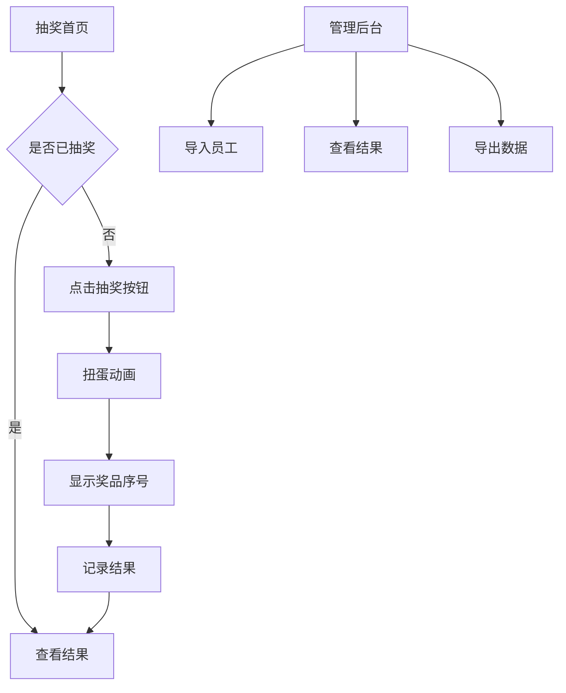

## 1. 产品概述
ANZ组织年会抽奖系统，为15位员工提供扭蛋式抽奖体验。员工可自主点击抽奖，获得奖品序号后兑换实物奖品，支持员工信息导入和抽奖结果导出。

## 2. 核心功能

### 2.1 用户角色
| 角色 | 注册方式 | 核心权限 |
|------|----------|----------|
| 普通员工 | 管理员导入 | 参与抽奖、查看个人抽奖结果 |
| 管理员 | 预设账号 | 导入员工信息、查看所有抽奖结果、导出数据 |

### 2.2 功能模块
抽奖系统包含以下核心页面：
1. **抽奖页面**：扭蛋动画、抽奖按钮、结果显示。
2. **管理页面**：员工信息导入、抽奖结果查看、数据导出。
3. **结果页面**：个人抽奖结果展示。

### 2.3 页面详情
| 页面名称 | 模块名称 | 功能描述 |
|----------|----------|----------|
| 抽奖页面 | 扭蛋动画区 | 显示3D扭蛋机，支持旋转和开启动画 |
| 抽奖页面 | 抽奖按钮 | 员工点击触发抽奖逻辑 |
| 抽奖页面 | 结果展示 | 显示获得的奖品序号 |
| 管理页面 | 员工导入 | 支持Excel/CSV文件上传或手动输入 |
| 管理页面 | 员工列表 | 显示已导入员工信息 |
| 管理页面 | 抽奖结果 | 显示所有员工抽奖结果 |
| 管理页面 | 数据导出 | 导出抽奖结果为Excel文件 |
| 结果页面 | 个人结果 | 显示当前员工抽奖获得的序号 |

## 3. 核心流程
### 员工抽奖流程
1. 员工进入抽奖页面
2. 点击"开始抽奖"按钮
3. 触发扭蛋机动画（旋转+开启）
4. 显示获得的奖品序号
5. 记录抽奖结果到数据库

### 管理员操作流程
1. 登录管理后台
2. 导入员工信息（Excel/CSV或手动）
3. 查看员工列表
4. 监控抽奖进度
5. 导出最终抽奖结果

## 4. 用户界面设计
### 4.1 设计风格
- **主色调**：金色(#FFD700)搭配深蓝色(#1E3A8A)
- **按钮样式**：3D立体效果，悬停动画
- **字体**：无衬线字体，标题24px，正文16px
- **布局风格**：居中对称，卡片式设计
- **图标风格**：圆润线条，配合抽奖主题

### 4.2 页面设计概览
| 页面名称 | 模块名称 | UI元素 |
|----------|----------|--------|
| 抽奖页面 | 扭蛋动画区 | 居中3D扭蛋机，金色外观，透明胶囊 |
| 抽奖页面 | 抽奖按钮 | 大号金色按钮，"开始抽奖"文字，点击波纹效果 |
| 抽奖页面 | 结果展示 | 弹窗显示奖品序号，金色背景 |
| 管理页面 | 员工导入 | 拖拽上传区域，支持Excel/CSV格式 |
| 管理页面 | 数据表格 | 清晰的数据展示，支持排序和筛选 |

### 4.3 响应式设计
- **桌面优先**：针对大屏幕优化扭蛋动画效果
- **移动端适配**：简化动画，优化触摸交互
- **加载优化**：动画资源预加载，确保流畅体验

### 4.4 动画效果指导
- **扭蛋机动画**：360度旋转+上下震动，持续2-3秒
- **胶囊掉落**：物理模拟，弹跳效果
- **开启动画**：胶囊分裂，序号弹出
- **粒子效果**：金色光点增强视觉冲击力