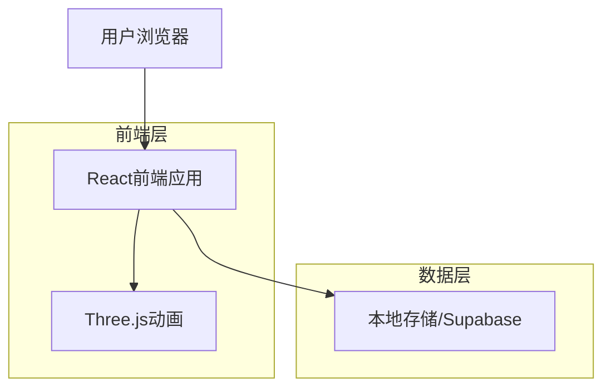
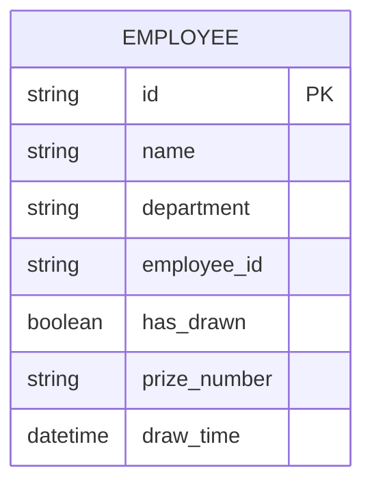
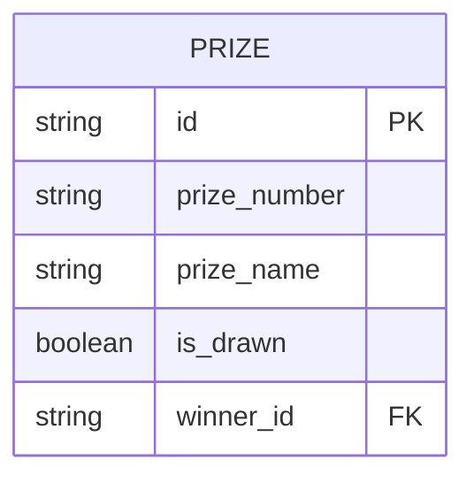

## 1. 架构设计



## 2. 技术描述

- **前端**: React@18 + TailwindCSS@3 + Vite
- **初始化工具**: vite-init
- **动画库**: Three.js + React Three Fiber
- **UI组件**: HeadlessUI + 自定义组件
- **数据存储**: LocalStorage（简单模式）或 Supabase（完整模式）
- **文件处理**: SheetJS（Excel导入导出）

## 3. 路由定义

| 路由 | 用途 |
|------|------|
| / | 抽奖主页，显示扭蛋机和抽奖按钮 |
| /result | 抽奖结果页面，显示获得的奖品序号 |
| /admin | 管理后台，员工信息管理和结果查看 |
| /admin/import | 员工信息导入页面 |

## 4. 数据模型

### 4.1 员工信息模型


### 4.2 奖品信息模型


### 4.3 数据定义语言

员工表（employees）
```sql
-- 创建员工表
CREATE TABLE employees (
    id UUID PRIMARY KEY DEFAULT gen_random_uuid(),
    name VARCHAR(100) NOT NULL,
    department VARCHAR(100),
    employee_id VARCHAR(50) UNIQUE NOT NULL,
    has_drawn BOOLEAN DEFAULT FALSE,
    prize_number VARCHAR(20),
    draw_time TIMESTAMP,
    created_at TIMESTAMP DEFAULT NOW()
);

-- 创建索引
CREATE INDEX idx_employees_employee_id ON employees(employee_id);
CREATE INDEX idx_employees_has_drawn ON employees(has_drawn);
```

奖品表（prizes）
```sql
-- 创建奖品表
CREATE TABLE prizes (
    id UUID PRIMARY KEY DEFAULT gen_random_uuid(),
    prize_number VARCHAR(20) UNIQUE NOT NULL,
    prize_name VARCHAR(200),
    is_drawn BOOLEAN DEFAULT FALSE,
    winner_id UUID REFERENCES employees(id),
    created_at TIMESTAMP DEFAULT NOW()
);

-- 创建索引
CREATE INDEX idx_prizes_prize_number ON prizes(prize_number);
CREATE INDEX idx_prizes_is_drawn ON prizes(is_drawn);
```

## 5. 核心功能实现

### 5.1 扭蛋动画组件
```typescript
interface GachaMachineProps {
    onDrawComplete: (prizeNumber: string) => void;
    isDrawing: boolean;
}

interface PrizeResult {
    prizeNumber: string;
    isWinner: boolean;
}
```

### 5.2 员工导入功能
```typescript
interface EmployeeImportData {
    name: string;
    department: string;
    employeeId: string;
}

interface ImportResult {
    success: number;
    failed: number;
    errors: string[];
}
```

### 5.3 抽奖结果导出
```typescript
interface ExportData {
    employeeName: string;
    employeeId: string;
    department: string;
    prizeNumber: string;
    drawTime: string;
}
```

## 6. 本地存储方案（简化版）

当不使用Supabase时，采用LocalStorage存储数据：

```typescript
// 数据结构设计
interface LocalStorageData {
    employees: Employee[];
    prizes: Prize[];
    settings: AppSettings;
}

// 数据持久化
const saveToLocal = (key: string, data: any) => {
    localStorage.setItem(key, JSON.stringify(data));
};

const loadFromLocal = (key: string) => {
    const data = localStorage.getItem(key);
    return data ? JSON.parse(data) : null;
};
```

## 7. 动画性能优化

- **模型优化**：扭蛋机模型控制在1000面以内
- **纹理压缩**：使用512x512分辨率纹理
- **动画帧率**：保持60fps，使用requestAnimationFrame
- **内存管理**：及时清理未使用的3D对象
- **加载策略**：关键资源预加载，非关键资源懒加载